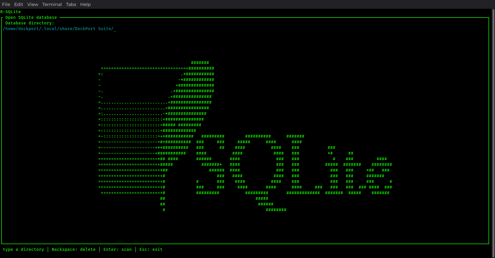
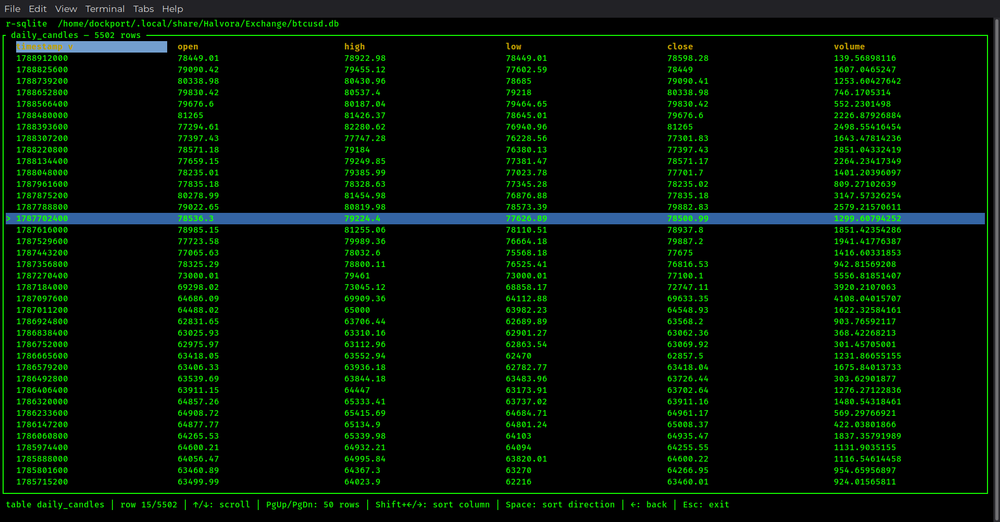

## Repo Overview
R-SQLite is a TUI SQLite database viewer written in Rust. The user will be able to view all contents of a database.

## Core Features
- Open a SQLite database file (read-only)
- List all tables (and other schema objects) in the database
- Browse the rows of a selected table in a read-only grid
- Show table structure in the grid (column names and types)
- Search across the content of the current table (Will be released with v1.1.0)

## Read-Only Constraint
The tool is a viewer and an analysis tool. It never can modify the database. SQLite is opened in read-only mode.

## Tech Stack 
| Component | Technology |
|---|---|
| Language | Rust |
| TUI Framework | ratatui |
| Terminal Backend | crossterm |
| SQLite Access | rusqlite |

## Screenshots

## How to run 

- The binary release is only for Linux x86_84 systems. 
- You can set the binary in a directory and make it exectuable. 
- From there you can create a desktop entry to run the binary with a click. 
- Or you could run via a terminal in various ways. 
